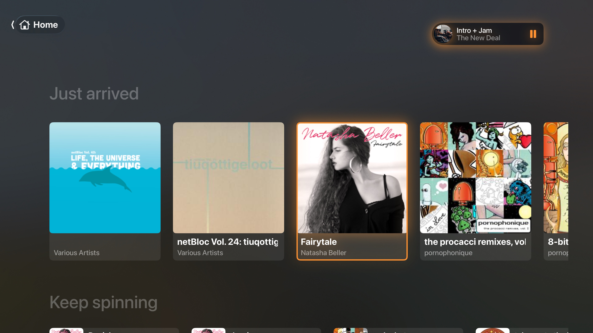
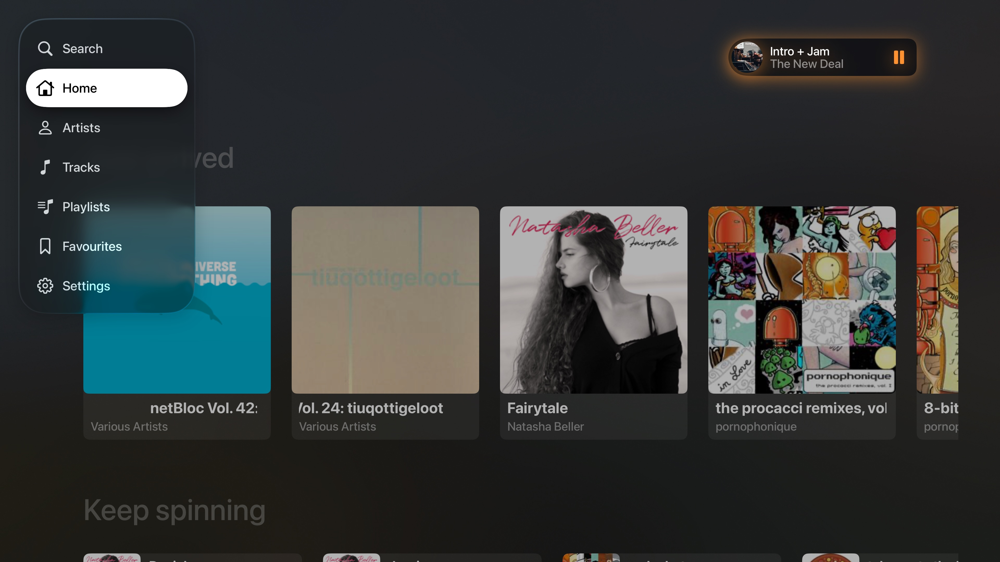
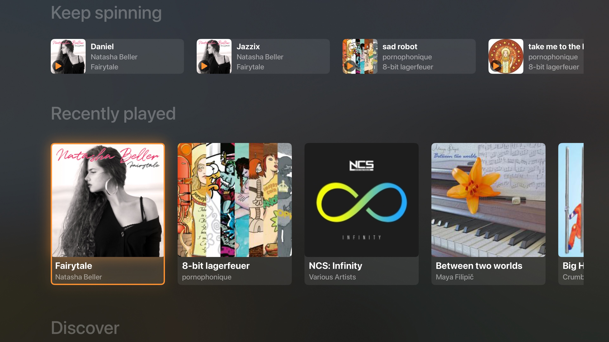
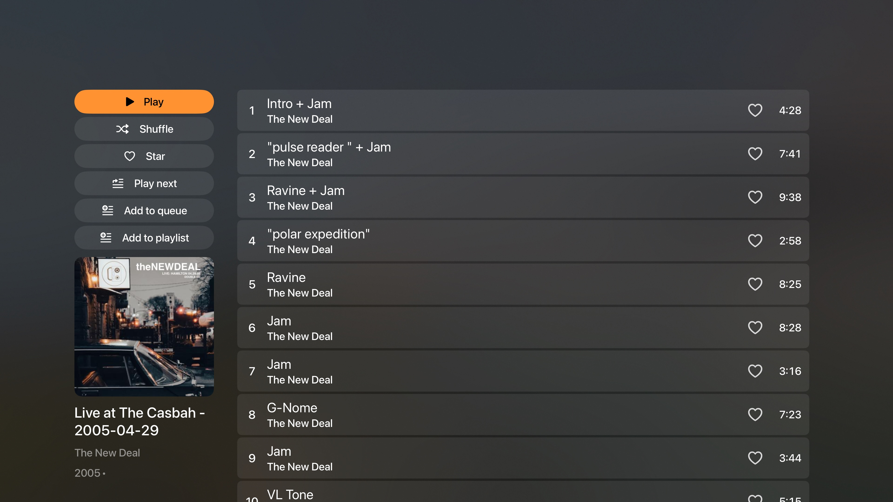
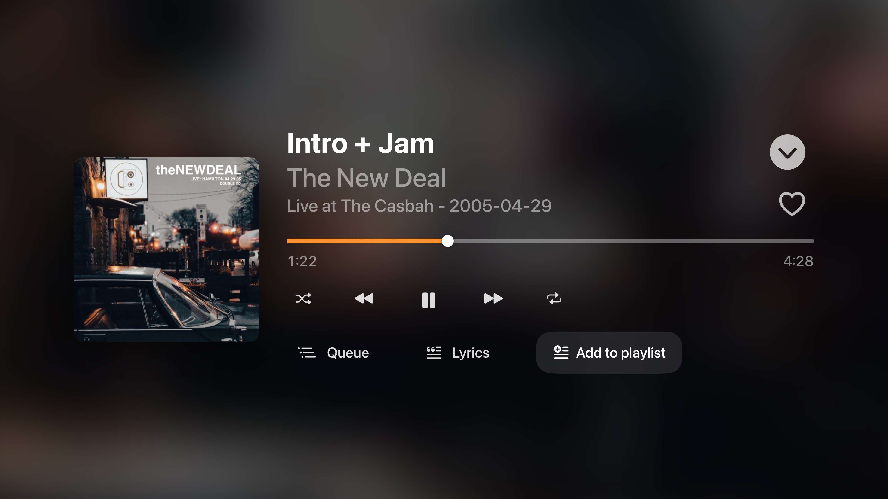
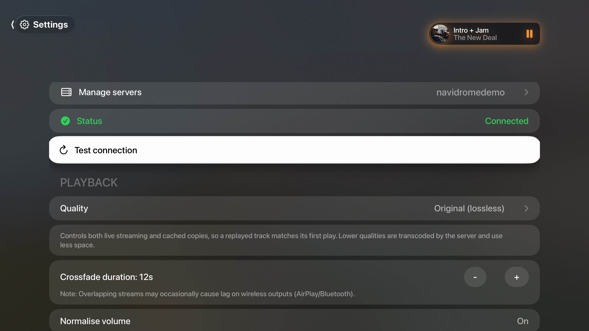

<p align="center">
  
</p>

<h1 align="center">earsonics</h1>

<p align="center">
  A native tvOS client for Subsonic-compatible music servers (Navidrome, Airsonic, Subsonic, Gonic, etc.), built with SwiftUI.
</p>

## Features

- Browse by artist, album, genre, and playlist, with a Home screen of shelves (Just arrived, Keep spinning, Recently played, Discover)
- Search across your whole library
- Gapless-ish playback with configurable crossfade, ReplayGain volume normalisation, and a persistent play queue
- Star/unstar and playlist management synced back to your server
- Selectable stream quality — original (lossless) or server-transcoded MP3 at 320/192 kbps
- On-device caching of played songs and cover art, with a configurable size cap and one-tap clearing
- Multiple servers, switchable from Settings; credentials are stored in the Keychain, never in plain text
- A focus-driven tvOS interface: marquee text for long titles, accent-colour focus rings, and a safe-area-aware now-playing bar

## Screenshots

<table>
  <tr>
    <td width="50%"><br><sub>Home — album shelves</sub></td>
    <td width="50%"><br><sub>Sidebar navigation</sub></td>
  </tr>
  <tr>
    <td><br><sub>Keep spinning &amp; Recently played</sub></td>
    <td><br><sub>Album detail &amp; track list</sub></td>
  </tr>
  <tr>
    <td><br><sub>Now Playing</sub></td>
    <td><br><sub>Settings</sub></td>
  </tr>
</table>

## Requirements

- Apple TV running tvOS 26.4 or later
- A running Subsonic-API-compatible server ([Navidrome](https://www.navidrome.org/), [Airsonic-Advanced](https://github.com/airsonic-advanced/airsonic-advanced), [Gonic](https://github.com/sentriz/gonic), etc.) reachable from the Apple TV
- Xcode 16+ to build and run (this is a source project — there is currently no App Store or TestFlight distribution)

## Building & running

1. Clone the repo and open `earsonics.xcodeproj` in Xcode.
2. Select the `earsonics` scheme and an Apple TV simulator or a physical device.
3. Build and run (⌘R).
4. On first launch, add your server's URL, username, and password from the Servers screen.

No API keys, secrets, or backend configuration are required — the app talks directly to the Subsonic server you point it at.

## Architecture at a glance

- **`Services/SubsonicClient.swift`** — the Subsonic REST API client. Requests are hedged: a slow/dead connection triggers a duplicate attempt on a fresh connection rather than a blind retry, so a stale pooled socket (e.g. after the app has been idle) can't silently stall a screen.
- **`Services/AudioCache.swift`** / **`CachingResourceLoaderDelegate.swift`** — an LRU on-disk cache that fills in the background as a track streams, so replays don't re-download.
- **`Services/ImageCache.swift`** — memory + disk cover-art cache, keyed by cover-art id (not URL, since every request carries a fresh auth salt).
- **`Shared/KeychainHelper.swift`** — Keychain-backed storage for server passwords.
- **`ViewModels/`** — `@MainActor` view models that own network state per screen.
- **`Views/`** — SwiftUI views, tvOS-focus-first.

## Contributing

Contributions are welcome — bug fixes, server-compatibility fixes, and small features are all useful. To contribute:

1. Fork the repo and create a branch off `main` for your change.
2. Keep changes focused; a PR is much easier to review if it does one thing.
3. Make sure the app builds and runs before opening a PR:
   ```bash
   xcodebuild -project earsonics.xcodeproj -scheme earsonics \
     -destination 'generic/platform=tvOS Simulator' build
   ```
4. Test on the tvOS simulator (or a device) — this is a UI-heavy app, and most regressions only show up by actually navigating the screen you touched.
5. Open a PR describing what changed and why. Screenshots or a short screen recording are appreciated for UI changes.
6. Add an entry to [`Changelog.md`](Changelog.md) under an "Unreleased" heading if one doesn't already exist.

### Reporting bugs / requesting features

Please open a GitHub issue. For bugs, include: what you did, what you expected, what happened instead, your server software (Navidrome, Airsonic, etc.) and version if relevant, and screenshots if the bug is visual.

### Code style

- No forced abstractions — prefer straightforward SwiftUI over premature generalisation.
- Comments should explain *why*, not *what* — the code should already say what it does.
- Match the existing formatting/structure of the file you're editing rather than introducing a new convention.

## License

MIT — see [`LICENSE`](LICENSE).

## Legal

See [`about.md`](about.md) and [`terms-and-conditions.md`](terms-and-conditions.md). In short: earsonics is an independent, unofficial client. It is not affiliated with the Subsonic project, Navidrome, or any streaming service, and it does not host, provide, or distribute any music itself — it only connects to a server you already run and control.

## Support

If earsonics is useful to you, there's an optional "buy me a coffee" link in the app's Settings → About section. Never required, always appreciated.
